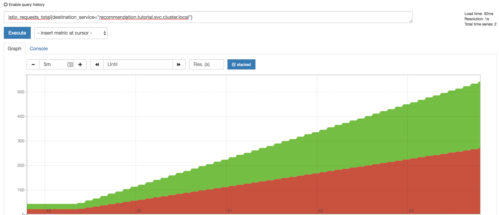

Istio also allows you to specify custom metrics which can be seen inside of the Prometheus dashboard.

Look at the file `/istiofiles/recommendation_requestcount.yml`{{open}}

It specifies an istio rule that invokes the `recommendationrequestcounthandler` for every invocation to `recommendation.tutorial.svc.cluster.local`

Let's go back to the istio installation folder:

`cd ~/projects/istio-tutorial/`{{execute T1}}

Now, add the custom metric and rule.

Execute `istioctl create -f istiofiles/recommendation_requestcount.yml -n istio-system`{{execute T1}}

Make sure that the following command is running on `Terminal 2` `while true; do curl http://customer-tutorial.[[HOST_SUBDOMAIN]]-80-[[KATACODA_HOST]].environments.katacoda.com; sleep .2; done`{{execute T2}}

Check the `prometheus` route by typing `oc get routes -n istio-system`{{execute T1}}

Now that you know the URL of Prometheus, access it at http://prometheus-istio-system.[[HOST_SUBDOMAIN]]-80-[[KATACODA_HOST]].environments.katacoda.com/graph?g0.range_input=1m&g0.stacked=1&g0.expr=&g0.tab=0 

Add the following metric:

`round(increase(istio_recommendation_request_count{destination="recommendation.tutorial.svc.cluster.local" }[60m]))`

and select `Execute`:

**Note:** You may have to refresh the browser for the Prometheus graph to update. And you may wish to make the interval 5m (5 minutes) as seen in the screenshot above.
